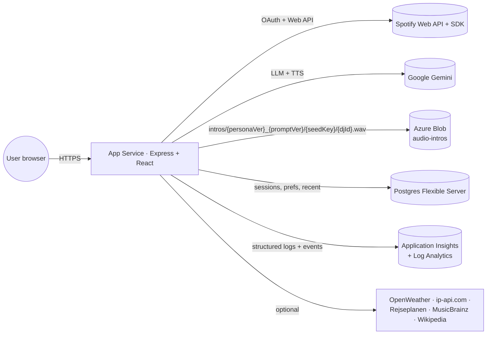

# SpotifAI Architecture

A focused map of where things live and how they connect. For deeper detail, the code is the source of truth — this doc tells you where to look.

## System map



## Repository layout

```
client/                 React 18 + Redux Toolkit + Vite
  Components/
    App.jsx             Top-level auth gate
    AppAuthWrapper.jsx  Routes + provider mounts
    SpotifyLogin.jsx    Pre-auth landing card
    PrivacyPage.jsx     /privacy
    shell/              AppShell, AccountMenu, BottomTabBar, ServiceWorkerUpdateToast
    player/             PlayerProvider + Spotify SDK + DJ overlay
    tabs/               Home, Search, Library + station/genre tiles
    ui/                 shadcn primitives
  lib/                  axios-free helpers (telemetry, registerSW, image)
  store/                Redux slices (user, player, djs, library, ...)
  styles/               Tailwind v4 entry

server/
  index.js              Boot: telemetry → logger → http.listen → syncAndSeed
  app.js                Express middleware chain
  routes/
    spotify.js          OAuth + session restore
    sessions.js         Unified /api/sessions/* (start, refill, jobs, intro-played, recent)
    content.js          /api/content/next-content (per-track DJ chatter)
    stations.js         Legacy /api/stations/* (still wired)
    profile.js          User profile CRUD
    health.js           /healthz + /readyz (App Service health probe)
  services/
    logger.js           Pino root logger
    telemetry.js        App Insights bootstrap + trackEvent/withDependency
    storage/
      blobStore.js      Azure Blob adapter + LocalDiskBlobAdapter fallback
    intros/
      introCacheKey.js  intros/{personaVer}_{promptVer}/{seedKey}/{djId}.wav
      getOrGenerateIntro.js  blob-existence cache, calls a generate() callback on miss
      introPlayedTracker.js  hasIntroBeenPlayed / recordIntroPlayed (DB)
    sessions/           Generators + DJ resolver + intro builder + recent store
    aiStations/         Legacy station orchestrator + weekly track cache
    rundown/            Per-track DJ chatter (showRunner)
    llm/                Provider-pluggable chat (Gemini)
    tts/                Provider-pluggable speech (Gemini → WAV)
    news/, transit/, currentWeather, musicFacts
    utl/
      hashUserId.js     HMAC-SHA256(email, SESSION_SECRET) → 16 hex chars
      personaVersion.js sha256 of personas/{slug}.md → 8 hex chars
      promptVersion.js  sha256 of station-intro.md + session-intro.md + dj-system.md + buildDJSystemPrompt.js
      loadPersonas.js   Reads personas/*.md → roster with image URL paths
  db/
    conn.js, index.js   Sequelize associations
    User, Profile, Settings, JamSession, JamSessionTracks, Tracks,
    AIStation, RecentSession, UserDjPreference, UserIntroPlayed, SeenArticle

infra/                  Bicep (azd up)
  main.bicep            Subscription-scope: rg + monitoring + appInsights + postgres + web + storage
  modules/
    monitoring.bicep    Log Analytics workspace (already there)
    appInsights.bicep   Workspace-based App Insights
    appService.bicep    Linux App Service B1 + MSI + diagnostic settings + healthCheckPath
    storage.bicep       Storage account + audio-intros container + Storage Blob Data Contributor role for the App Service MSI
    postgresql.bicep    Postgres Flexible Server

prompts/                Nunjucks templates for LLM prompts
personas/               One markdown file per DJ (YAML front-matter + sections)
public/                 Committed static assets (icons, manifest, dj avatars, station covers, pre-baked DJ voice intros)
runtime/                Gitignored runtime output (LocalDiskBlobAdapter target in dev)
scripts/                One-off node scripts (seed-*, optimize-images, build-pwa-icons, smoke, prompt-lab)
```

## The four flows worth understanding before changing things

### 1. OAuth + session restore

`SpotifyLogin` → Spotify authorize redirect → callback hits `/?code=...` → `useAuth(code)` POSTs `/api/spotify/login` → `req.session.{accessToken,refreshToken,email}` set → client gets `{accessToken, expiresIn, userIdHash, profile}`. On reload `App.componentDidMount` calls `restoreSession` (skipped on the OAuth callback turn to avoid a 401 race).

**Gotcha:** the OAuth redirect URI must be `http://127.0.0.1:3000` exactly, not `localhost`. Spotify treats them as different origins.

### 2. Session start (user taps Mellow Beats)

`useStartSession.start(seed)` → `stopCurrentPlayback()` (kills old music + DJ overlay) → POST `/api/sessions/start` → server resolves DJ via `resolveSessionDj` → calls `createSessionIntro` (or `createStationIntro` for station seeds) → `getOrGenerateIntro` checks blob; cache hit returns URL, miss runs LLM + TTS and uploads. If `UserIntroPlayed` row exists, the orchestrator omits the intro from the response (the user has heard this combo's intro before). Client plays the intro through its own `<audio>`; on `ended` it POSTs `/api/sessions/intro-played` and `PlayerProvider.playSession` starts Spotify playback.

For mood/track/artist seeds, tracks generate asynchronously — client polls `/api/sessions/jobs/{id}` while the intro plays.

### 3. Per-track DJ chatter

The Spotify SDK fires `track_update` → `PlayerProvider.prepareNextDjAudio` posts to `/api/content/next-content` with current + next track + jamSession + djId → `showRunner` decides whether the next slot is weather / news / music-fact / song-intro and emits a WAV (still writes to `runtime/audio/` locally — has not yet been migrated to blob). The audio plays through `PlayerProvider`'s overlay `<audio>` which ducks Spotify volume during DJ speech.

### 4. Telemetry

Server: `require("./services/telemetry")` is the **first thing** in `server/index.js` so the App Insights SDK can hook console/HTTP/Postgres. Per-request `requestId` is set by middleware in `server/app.js` and attached to every Pino log line and Insights event. Custom events fire from the high-leverage paths (`session.start`, `intro.cache.hit|miss`, `llm.invoke`, `tts.synthesize`, `spotify.search.batch`, `session.refill.{start,end}`).

Client: `initTelemetry()` in `client/index.jsx` boots App Insights (no-op if no connection string or if the user opted out via `/privacy`). `setAuthUser(userIdHash)` is called after login + restoreSession so cross-device telemetry collapses onto the same user. Query strings are scrubbed by a telemetry initializer before send.

## Cross-cutting conventions

- **No email in logs or telemetry.** Use `hashUserId(email)` from `server/services/utl/hashUserId.js`. DB rows still store email — that's the join key.
- **Routes return JSON errors.** Pattern is `try {…} catch (err) { const status = err?.status || 500; if (status >= 500) logger.error(...); res.status(status).json({ error: 'short_code', message: err.message }) }`.
- **Don't run `npm install`, `git push`, or destructive scripts without explicit user OK.** Same for `azd up`.
- **Static images stay on disk.** Generated audio goes to blob via `services/storage/blobStore`. Don't add a new code path that writes audio to `runtime/audio/` in production.
- **Cache invalidation is built-in via path-versioning.** Edit a persona or a prompt template → the next `getOrGenerateIntro` call computes a different `personaVersion`/`promptVersion` and the cache forks. You don't need a manual cache-bust.

## See also

- [docs/local-development.md](local-development.md) — running locally, VS Code task names, gotchas
- [docs/conventions.md](conventions.md) — style and patterns
- [docs/observability.md](observability.md) — App Insights events, Kusto run-book
- [.github/copilot-instructions.md](../.github/copilot-instructions.md) — agent entry point
- [personas/README.md](../personas/README.md), [prompts/README.md](../prompts/README.md) — content authoring
